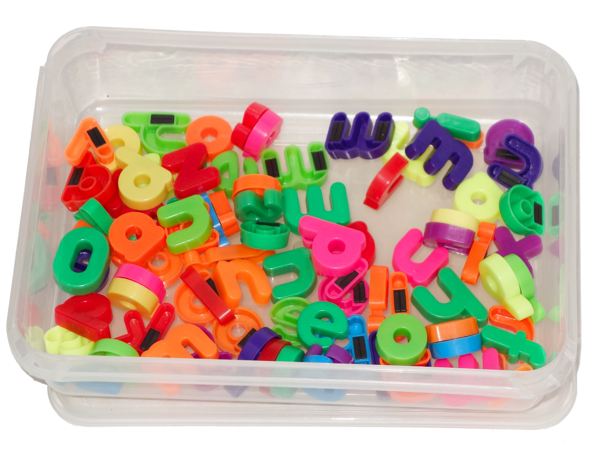
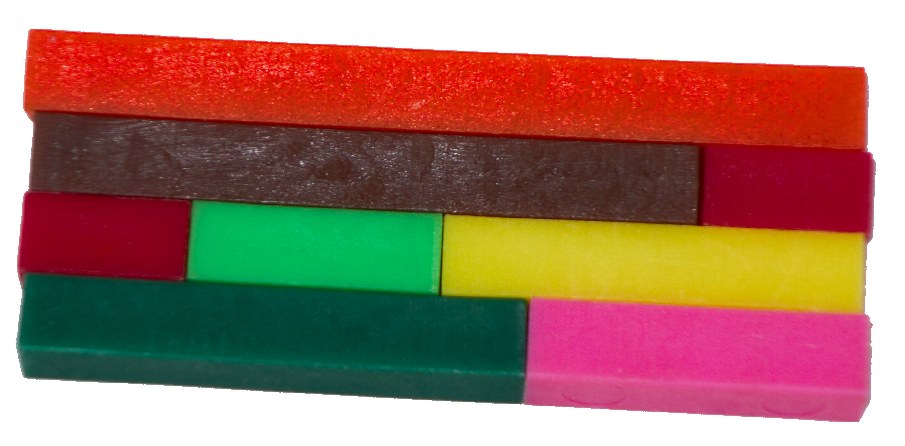

I have a diploma in dyslexia and am experienced in teaching children with specific learning difficulties such as dyslexia, dyspraxia and dyscalculia. I teach through a multisensory approach, combining visual, auditory and kinaesthetic learning.

I am knowledgeable in teaching phonics to aid reading and spelling. I have lots of engaging activities and multisensory approaches that I use. I make sure that the programme I devise for each child is highly structured.

It’s important that abstract concepts such as our alphabetical numerical system are made more concrete. I use specialist teaching apparatus to help with this. This provides your child with a hands-on and visual experience to help make some of the more difficult concepts clearer.

Overlearning is really important for children with specific learning difficulties. Without it, children find it hard to remember new information. Repetition, recapping, and reinforcement of new material is vital and I make sure I build this into my teaching in a fun and varied manner. I also try to find ways to cut down the number of facts children have to learn. Some children struggling to learn their times tables will find it much easier to learn the 4x and 8x tables by “doubling up” from the 2x table rather than trying to remember lots of individual facts.

---

For children struggling with maths, developing their knowledge of number is really important. If needed, I will assess your child’s strengths and weaknesses so that I can help them build a strong understanding of number. Children with dyscalculia may struggle with understanding and writing the teen numbers as the ten comes after the units in the name.

Working confidently with numbers from 0 to 20 is also important; I can assess and help with this if needed. Another area that may provide difficulty is the idea of place value: digits being worth different amounts depending on where they are in a number. The 1 in the following two numbers means different things – 51 and 1,564. I have lots of resources and ideas for helping children who struggle with these fundamental mathematical building blocks. Other children may find that word problems are difficult, or the concept of fractions, decimals and percentages bewildering. I can help with these too.

---

If a child is struggling in school, it is really important to boost their confidence. I do this in a number of ways. Firstly, by designing learning programmes that are carefully structured and tailored to their needs. Additionally, I make sure that there is a link between old and new information so that children have an anchor on which to secure their new learning. I also encourage children to stop me as soon as something is unclear so I can quickly help with the problem. Some children feel shy about saying something, but using coloured ‘traffic lights’ provides a novel and fun motivator. Finally and most importantly, I make sure that learning is FUN.

If your child has difficulty with handwriting, I can help them with this too.
