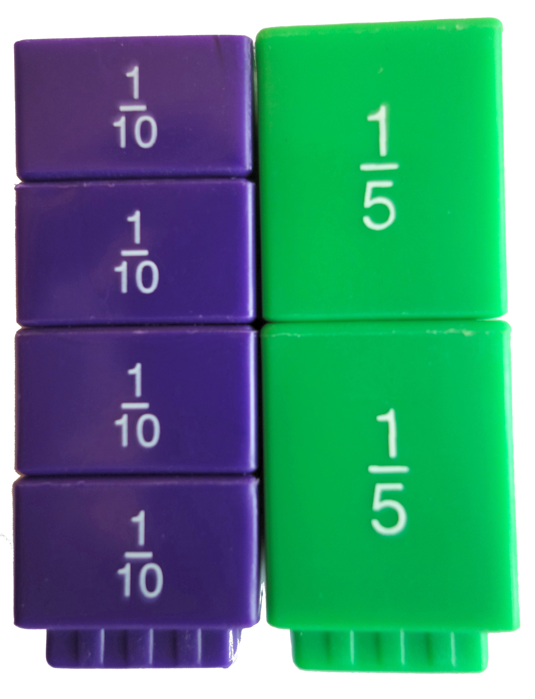

Many children struggle with maths and reading. I use various practical resources to help them form mental pictures. These pictures are the building-blocks of understanding that will last your child a lifetime.

Some children require lots of practice and reinforcement. I provide this in varied ways to keep their interest and attention.

When designing teaching programmes, I ensure there are lots of visual, auditory and kinaesthetic activities to strengthen learning.

